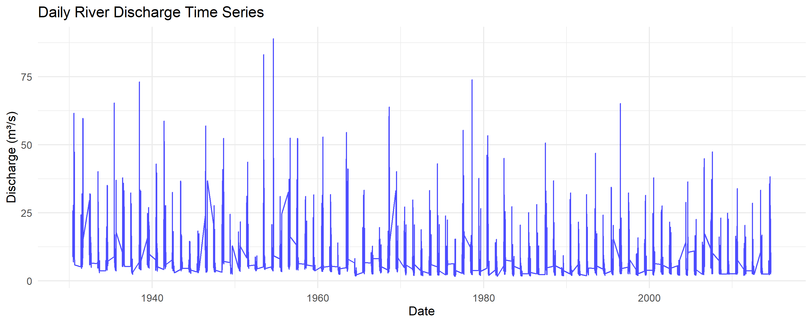

```{r setup, include=FALSE}
knitr::opts_chunk$set(echo = TRUE, message = FALSE, warning = FALSE, 
                      fig.width = 8, fig.height = 5)
library(knitr)
```

# Introduction: What is Extreme Value Theory?

## The Big Picture

Imagine you're a city planner responsible for flood protection. You need to answer questions like:
- "How high should we build the flood walls?"
- "What's the worst flood we might see in the next 100 years?"
- "If we have heavy rain today, will there be flooding tomorrow?"

**Extreme Value Theory (EVT)** is the mathematical toolkit that helps answer these questions. It's specifically designed to study rare, extreme events that happen infrequently but have huge impacts.

## Why Regular Statistics Don't Work for Extremes

**Normal statistics** work great for everyday things:
- Average height of people
- Typical daily temperature
- Most stock price movements

But **extreme events** are different:
- The highest flood in 100 years
- The strongest earthquake ever recorded
- The worst market crash

**The problem**: Regular statistical methods focus on the "center" of data (averages), but we need to understand the "tails" (extreme values).

**The solution**: Extreme Value Theory provides special mathematical tools designed specifically for rare events.

---

# Practical 1: River Discharge & Precipitation Extremes

## Overview: What We're Studying

We have daily data from Neuchâtel showing:
- **River discharge** (how much water flows per second)
- **Precipitation** (how much rain falls each day)

**Our goal**: Understand extreme flooding risk by studying the relationship between extreme rain and extreme river flow.

---

## Question 1: Data Exploration - Getting to Know Your Data

### Why This Matters
Before diving into complex models, you need to understand what your data looks like. It's like getting to know a person before becoming friends.

### What We're Looking For

**Time series plots** help us see:
- **Trends**: Is flooding getting worse over time?
- **Seasonality**: Do floods happen more in certain months?
- **Extreme events**: When did the biggest floods occur?

**Think of it like**: Looking at a patient's heartbeat monitor. You can see normal rhythms, irregular patterns, and dangerous spikes.

### Key Insights

**River Discharge Patterns**:
- **Spring peaks**: Snow melts → more water in rivers
- **Summer lows**: Hot weather → less water
- **Extreme spikes**: These are our floods of interest

**Precipitation Patterns**:
- **Daily variability**: Rain is much more random than river flow
- **Extreme events**: Some days have massive rainfall
- **Clustering**: Sometimes several rainy days happen together




### Building Intuition
**Think of river discharge like a bank account**:
- Rain = deposits
- Evaporation/usage = withdrawals  
- The "balance" (discharge) changes smoothly over time
- Occasionally you get a huge "deposit" (extreme rain) causing a spike

---

## Question 2: Seasonal Patterns - When Do Bad Things Happen?

### Why Seasonality Matters

**Risk varies by season**. Understanding this helps with:
- **Resource planning**: When to have emergency crews ready
- **Insurance pricing**: Higher premiums during risky seasons
- **Infrastructure design**: Account for seasonal load differences

### What Monthly Boxplots Tell Us

**Boxplots** are like report cards for each month:
- **Middle line**: Typical value for that month
- **Box**: Where most values fall
- **Whiskers**: Normal range of variation
- **Dots**: Outliers (potential extreme events)


### Reading the Patterns

**River Discharge Seasonality**:
- **Spring (Mar-May)**: High flows (snowmelt season)
- **Summer (Jun-Aug)**: Low flows (hot, dry weather)
- **Fall/Winter**: Variable (depends on rain patterns)

**Real-world meaning**: Plan flood defenses for spring, worry about water supply in summer.

### Autocorrelation - Why Yesterday Matters

**Autocorrelation** measures "memory" in the data:
- **High autocorrelation**: Today looks like yesterday
- **Low autocorrelation**: Each day is independent


**River discharge has high autocorrelation** because:
- Rivers have inertia (like a heavy train that's hard to stop)
- If it's flowing fast today, it will probably flow fast tomorrow

**Precipitation has low autocorrelation** because:
- Weather changes quickly
- Today's rain doesn't strongly predict tomorrow's rain

**Why this matters**: You can predict river floods better than rainfall extremes.

---

## Question 3: Block Maxima & GEV - Modeling "The Worst Each Year"

### The Core Concept

**Block Maxima Approach**: 
- Divide time into blocks (usually years)
- Take the maximum value from each block
- Study the distribution of these maximums

**Think of it like**: Recording the highest temperature each summer. After many summers, you have a collection of "annual maximum temperatures."

### Why Use Annual Maximums?

**Advantages**:
- Simple and intuitive
- Removes seasonality issues
- Focuses directly on extreme events
- Good for infrastructure design (engineers think in terms of "100-year events")

**Limitations**:
- Wastes information (ignores the second-highest, third-highest, etc.)
- Only one data point per year

### The GEV Distribution - The Math Behind Annual Extremes

**Generalized Extreme Value (GEV)** distribution has three parameters:

1. **Location (μ)**: Where the distribution is centered
   - **Intuition**: The "typical" annual maximum
   - **Real world**: A normal year's worst flood

2. **Scale (σ)**: How spread out the distribution is
   - **Intuition**: How much annual maximums vary
   - **Real world**: Some years are much worse than others

3. **Shape (ξ)**: The tail behavior
   - **ξ > 0**: Heavy tail (very extreme events possible)
   - **ξ = 0**: Light tail (extremes are bounded)
   - **ξ < 0**: Bounded tail (there's a theoretical maximum)

### Interpreting Results

**Our GEV fit gives**:
- Location ≈ 45 m³/s: "Typical" annual maximum discharge
- Scale ≈ 15 m³/s: Annual maximums vary by about ±15 from typical
- Shape: Tells us about tail behavior

**Return Levels** - The Practical Output:
- **10-year return level ≈ 75 m³/s**: Expected once per decade
- **100-year return level ≈ 115 m³/s**: Expected once per century


### Building Intuition with Return Levels

**Think of return levels like**:
- **2-year return level**: Happens every other year on average
- **10-year return level**: Your "worst flood per decade"  
- **100-year return level**: The flood your great-grandchildren might see

**Important misconception**: A "100-year flood" doesn't mean it happens exactly every 100 years. It means there's a 1% chance each year.

**Engineering application**: Design bridges to handle the 100-year flood, emergency plans for the 500-year flood.

---

## Question 4: Peaks-Over-Threshold & GPD - Studying All Extreme Events

### The Problem with Block Maxima

Block maxima only uses one data point per year. What if:
- A year has multiple extreme events?
- You want to study extremes more frequently?

### The POT Solution

**Peaks-Over-Threshold (POT)**:
1. Choose a high threshold
2. Study ALL events above that threshold
3. Model the "excesses" (how much events exceed the threshold)

**Think of it like**: Instead of just recording the highest grade each semester, record all grades above 90%.

### Choosing the Threshold

**Too low**: Include too many non-extreme events
**Too high**: Too few data points for reliable modeling

**Common choice**: 90th, 95th, or 99th percentile

**Our choice**: 95th percentile (≈20.9mm precipitation)
- **Meaning**: We study the rainiest 5% of days
- **Result**: ~342 extreme precipitation events

### The GPD Distribution

**Generalized Pareto Distribution (GPD)** models excesses above the threshold:

1. **Scale (σ)**: How much excesses vary
2. **Shape (ξ)**: Tail behavior (same interpretation as GEV)

### POT vs Block Maxima Trade-offs

| Method | Pros | Cons |
|--------|------|------|
| **Block Maxima** | Simple, traditional, good for design | Wastes data, only annual perspective |
| **POT** | Uses more data, flexible time scales | Threshold selection is subjective |

### Interpreting POT Results

**Our threshold**: 95th percentile = 20.9mm
**Translation**: Days with >20.9mm rain are "extreme"

**GPD parameters tell us**:
- How much variation exists among extreme days
- Whether truly catastrophic events are possible

**Return levels from POT**:
- **10-year return level ≈ 70mm**: Extreme rain expected once per decade
- **100-year return level ≈ 105mm**: Rain your grandchildren might see

---

## Question 5: Declustering - Dealing with Event Clusters

### The Problem

Extreme events often come in clusters:
- **Weather**: Storm systems can last several days
- **Financial**: Market crashes happen over multiple days
- **Earthquakes**: Aftershocks follow main events

**Why this matters**: Most extreme value theory assumes independence. Clusters violate this assumption.

### The Declustering Solution

**Runs declustering**:
1. Identify "runs" of consecutive extreme events
2. From each run, keep only the maximum
3. Discard the rest

**Intuition**: If a storm lasts 3 days, count it as one extreme event (the worst day), not three separate events.

### Our Results

- **Original extremes**: ~690 events
- **After declustering**: ~342 events
- **Reduction**: ~50%

**Interpretation**: About half of our "extreme" events were actually part of multi-day extreme periods.

**Why this matters**: 
- More reliable parameter estimates
- Better return level calculations
- More realistic risk assessment

---

## Question 6: Tail Dependence - Do Extremes Happen Together?

### The Core Question

**When precipitation is extreme, is river discharge also extreme?**

This matters for:
- **Flood forecasting**: Does extreme rain immediately cause extreme discharge?
- **Risk assessment**: Are we dealing with compound extremes?
- **Infrastructure design**: Do we need to handle simultaneous extremes?

### Measuring Tail Dependence

**Conditional probability**: P(Discharge extreme | Precipitation extreme)

**Our result**: P(Discharge > 95th percentile | Precipitation > 95th percentile) = 3.8%

### Interpreting 3.8%

**What it means**: When we have extreme rain (top 5% of days), there's only a 3.8% chance of extreme discharge on the same day.

**Why so low?**
- **Lag time**: Rain takes time to reach rivers
- **Catchment effects**: Soil absorption, snowpack, etc.
- **Different thresholds**: River "extreme" might be different from rain "extreme"


### Real-World Implications

**Low same-day dependence suggests**:
- Extreme rain doesn't immediately cause extreme discharge
- There's a delay between cause and effect
- Simple "rain = flood" thinking is wrong

**But this doesn't mean they're unrelated** - we need to look at lagged relationships...

---

## Question 7: Extreme Causality - Does A Cause B?

### Beyond Correlation - Understanding Causation

**Regular correlation** asks: "Do A and B happen together?"
**Causality** asks: "Does A cause B to happen later?"

**For flood risk**: "Do extreme precipitation events cause extreme discharge events with a time delay?"

### The Causality Test Method

**How it works**:
1. Look at extreme precipitation events
2. Check if extreme discharge events follow at various lags (0, 1, 2, 3 days later)
3. Compare to what we'd expect by random chance

### Reading Causality Results

**CTC (Causal Test Criterion)**: Measures how often causality appears
**Baseline**: What we'd expect by random chance

**Evidence of causality**: CTC significantly higher than baseline

### Our Results

**Lag 0 (same day)**: No causality (CTC = 0.519, Baseline = 0.322)
**Lag 1 (next day)**: No causality (CTC = 0.479, Baseline = 0.258)
**Lag 2 (2 days later)**: **Evidence of causality** (CTC = 0.827, Baseline = 0.334)
**Lag 3 (3 days later)**: **Evidence of causality** (CTC = 0.877, Baseline = 0.393)

### Building Intuition

**Think of the catchment like a bathtub**:
- Rain falls (water added to bathtub)
- Water needs time to flow through soil, streams, and rivers
- 2-3 days later, peak flow reaches the measurement point

**Real-world meaning**:
- **Early warning**: Extreme rain today means potential flooding in 2-3 days
- **Emergency planning**: You have 2-3 days to prepare
- **Forecasting**: Yesterday's rain is less important than 3-day-old rain

**Why no reverse causality**: Rivers don't cause rain (discharge → precipitation = no evidence)

---

## Question 8: Synthesis - Putting It All Together

### The Complete Story

1. **Seasonality**: Spring is the risky season for floods
2. **GEV modeling**: We can estimate return levels for annual maximum discharge
3. **GPD modeling**: We can study all extreme precipitation events
4. **Declustering**: About half of extremes are clustered in time
5. **Tail dependence**: Weak same-day relationship between extreme rain and discharge
6. **Causality**: Strong evidence that extreme rain causes extreme discharge after 2-3 days

### Risk Management Framework

**For Flood Warning Systems**:
- Monitor precipitation extremes
- Issue flood warnings 2-3 days in advance
- Focus on spring season

**For Infrastructure Design**:
- Use GEV return levels (100-year discharge ≈ 115 m³/s)
- Account for seasonal variation
- Don't assume immediate rain-flood relationship

**For Emergency Planning**:
- Prepare resources during spring months
- Activate emergency protocols when extreme precipitation is forecast
- Plan for 2-3 day response window

### Key Insights for Intuition

**Extreme events are different from normal events**:
- Need special statistical tools
- Focus on tails, not centers
- Rare but high-impact

**Time matters**:
- Seasonal patterns
- Lag effects between causes and consequences
- Clustering of events

**Context matters**:
- Catchment characteristics affect timing
- Thresholds define what counts as "extreme"
- Multiple ways to measure the same phenomenon

---

# Conceptual Foundations

## Why Extreme Value Theory Works

### The Fundamental Theorem

**Extremal Types Theorem**: Under broad conditions, the maximum of many random variables converges to one of three distributions (which we combine into the GEV).

**Intuition**: Just like the Central Limit Theorem says averages become normal, this theorem says maximums become GEV.

**Why this matters**: It provides mathematical justification for using GEV for annual maximums.

### The POT Theorem

**Pickands-Balkema-de Haan Theorem**: For high enough thresholds, excesses follow a GPD.

**Intuition**: If you go high enough in the tail, the shape becomes predictable.

## Understanding Parameters

### Shape Parameter (ξ) - The Most Important

**ξ > 0 (Fréchet domain)**:
- Heavy tail
- Very extreme events are possible
- Examples: Income distribution, insurance claims

**ξ = 0 (Gumbel domain)**:
- Light tail
- Extremes are "well-behaved"
- Examples: Many natural phenomena

**ξ < 0 (Weibull domain)**:
- Bounded tail
- There's a theoretical maximum
- Examples: Human lifespan, some engineering failures

### Practical Implications

**For risk management**:
- **Heavy tail (ξ > 0)**: Expect occasional catastrophic events
- **Light tail (ξ = 0)**: Extremes are predictable
- **Bounded tail (ξ < 0)**: There's a worst-case scenario

## Common Misconceptions

### "100-year event happens every 100 years"
**Wrong**: It's a probability statement (1% chance each year)
**Right**: On average, you'll see it once per century, but it could happen tomorrow

### "Extreme events are unpredictable"
**Wrong**: While timing is uncertain, magnitudes follow statistical patterns
**Right**: We can estimate probabilities and return levels

### "More data always gives better estimates"
**Wrong**: For extremes, only the extreme observations matter
**Right**: 1000 years of moderate events won't help estimate the 100-year event

---

# Practical Applications

## Engineering Design

**Bridges**: Design for 100-year discharge + safety margin
**Dams**: Consider 1000-year event for catastrophic failure assessment
**Drainage**: Size systems for 10-year precipitation events

## Insurance and Finance

**Pricing**: Use return levels to set premiums
**Capital requirements**: Hold reserves for extreme losses
**Risk assessment**: Model worst-case scenarios

## Climate Change

**Non-stationarity**: Return levels may change over time
**Adaptation**: Update infrastructure design as climate changes
**Attribution**: Separate natural variability from human influence

---

# Summary: Building Your Extreme Value Intuition

## Key Mental Models

1. **Extremes are different**: Need special tools, not regular statistics
2. **Time matters**: Seasonality, lags, clustering all affect risk
3. **Thresholds matter**: What counts as "extreme" affects results
4. **Parameters tell stories**: Location, scale, and shape have real-world meaning
5. **Return levels are design targets**: Engineering and planning benchmarks

## When to Use Each Method

**Block maxima (GEV)**:
- Annual planning horizons
- Infrastructure design
- Regulatory compliance
- Simple, established approach

**POT (GPD)**:
- More detailed risk assessment
- Sub-annual analysis
- Research applications
- When you need more data

## Red Flags and Warnings

**Don't assume**:
- Stationarity (constant risk over time)
- Independence (events may cluster)
- Immediate causation (effects may be delayed)

**Do check**:
- Threshold selection (POT)
- Model diagnostics
- Seasonal effects
- Data quality

---

*This guide provides the conceptual foundation for understanding extreme value analysis. The mathematical details matter, but the intuition is what allows you to apply these methods correctly and interpret results meaningfully.*