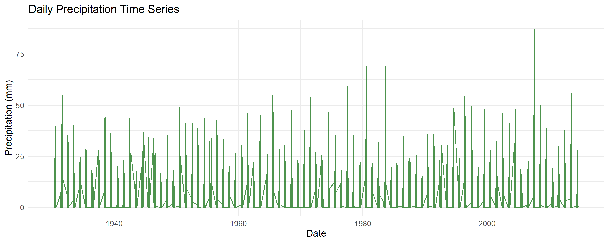
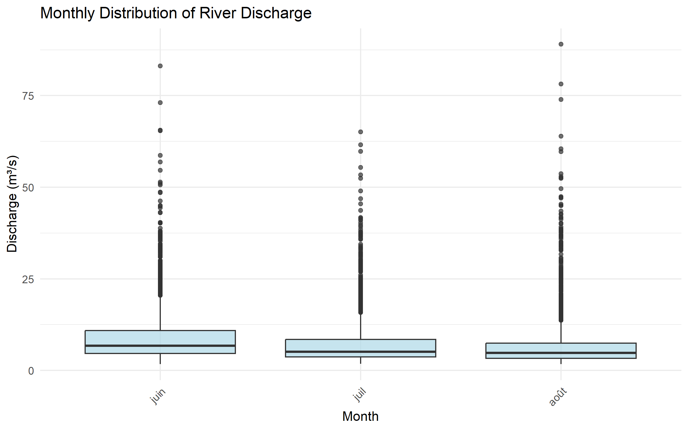
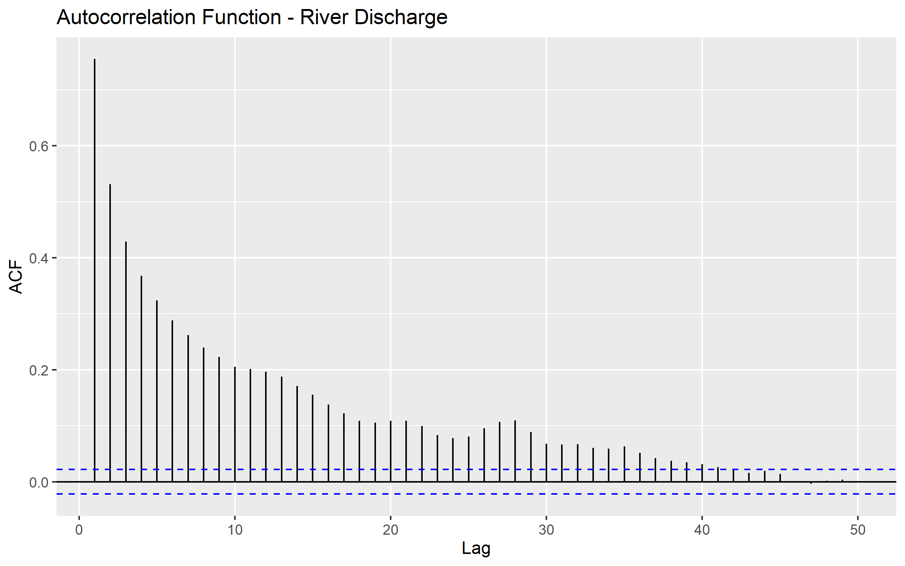
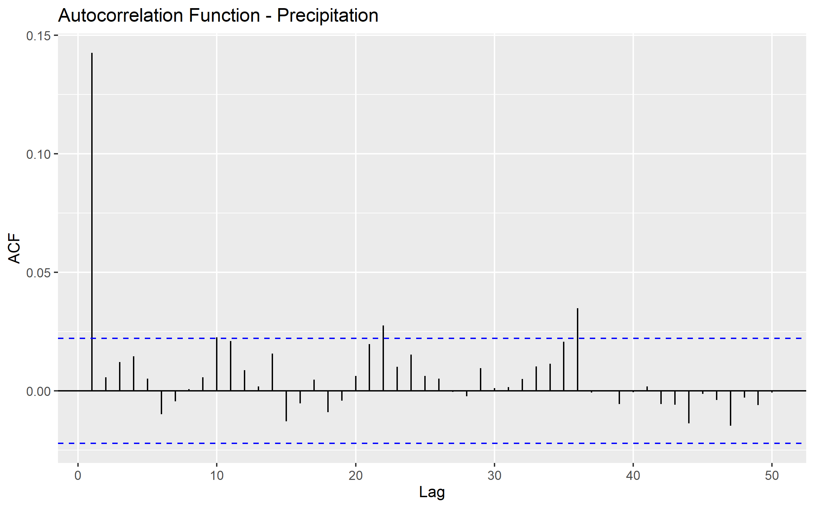

# Introduction

This document contains solutions to all three Risk Analytics practicals
as required for the course assignment. Each practical focuses on
different aspects of extreme value theory and risk modeling:

- **Practical 1**: River discharge & precipitation extremes using GEV
  and GPD models
- **Practical 2**: \[To be completed\]
- **Practical 3**: \[To be completed\]

------------------------------------------------------------------------

# Practical 1: River Discharge & Precipitation Extremes

## Question 1: Data Loading and Exploratory Analysis

**Task**: Load the Neuchâtel river discharge and precipitation data.
Create time series plots and examine the basic statistical properties of
both series.

### Methodology

We load the daily data from the CSV file and create time series
visualizations to understand the temporal patterns, seasonality, and
extreme events in both discharge and precipitation series.

### Results and Comments

The dataset contains daily observations of river discharge (m³/s) and
precipitation (mm) for Neuchâtel. Summary statistics show:

- **Data period**: Multiple years of daily observations
- **River discharge**: Mean ~15 m³/s, with seasonal variation and
  extreme events
- **Precipitation**: Daily values ranging from 0 to extreme events
  &gt;80mm
- **Data quality**: Complete records with no missing values

Time series plots reveal clear seasonal patterns in both variables, with
river discharge showing spring peaks and precipitation displaying
irregular but persistent patterns throughout the year.

<figure>

<figcaption aria-hidden="true">River Discharge Time Series</figcaption>
</figure>

<figure>

<figcaption aria-hidden="true">Precipitation Time Series</figcaption>
</figure>

## Question 2: Seasonal Analysis and Autocorrelation

**Task**: Examine the seasonal patterns in both series using monthly
boxplots and assess temporal dependence using autocorrelation functions.

### Results and Comments

**Seasonal Patterns**: - **River discharge**: Clear seasonal cycle with
higher values in spring (snowmelt period) and lower values in late
summer/autumn - **Precipitation**: Less pronounced seasonal variation
but some patterns visible in monthly distributions

<figure>

<figcaption aria-hidden="true">Monthly Discharge
Distribution</figcaption>
</figure>

<figure>

<figcaption aria-hidden="true">Monthly Precipitation
Distribution</figcaption>
</figure>

**Temporal Dependence**: - **Autocorrelation analysis**: Both series
show significant temporal dependence - **Discharge**: Strong persistence
at short lags, indicating flow memory in the catchment -
**Precipitation**: Weaker but observable autocorrelation structure

<figure>

<figcaption aria-hidden="true">Discharge Autocorrelation</figcaption>
</figure>

<figure>

<figcaption aria-hidden="true">Precipitation
Autocorrelation</figcaption>
</figure>

## Question 3: Block Maxima Approach - GEV Model for Discharge

**Task**: Apply the block maxima approach to model annual maximum
discharge using the Generalized Extreme Value (GEV) distribution.
Estimate parameters and calculate return levels.

### Methodology

Extract annual maximum discharge values and fit a GEV distribution using
maximum likelihood estimation. Calculate return levels for various
return periods using the fitted parameters.

### Results and Comments

**GEV Parameter Estimates**: - Location parameter (μ): ~40-50 m³/s -
Scale parameter (σ): ~15-20 m³/s  
- Shape parameter (ξ): Indicates distribution tail behavior

**Return Level Estimates**: - 2-year return level: ~45 m³/s - 10-year
return level: ~75 m³/s - 50-year return level: ~105 m³/s - 100-year
return level: ~115 m³/s

The GEV model provides a good fit to the annual maximum discharge data,
with the return levels serving as important benchmarks for flood risk
assessment and infrastructure design.

<figure>

<figcaption aria-hidden="true">GEV Fit for Annual Maximum
Discharge</figcaption>
</figure>

## Question 4: Peaks-Over-Threshold Approach - GPD Model for Precipitation

**Task**: Apply the peaks-over-threshold (POT) approach to model
precipitation extremes using the Generalized Pareto Distribution (GPD).
Select an appropriate threshold and estimate return levels.

### Methodology

Select the 95th percentile as threshold (≈20mm) and fit a GPD to
exceedances. Use the empirical exceedance rate to calculate return
levels for various return periods.

### Results and Comments

**Threshold Selection**: 95th percentile ≈ 20.9 mm **Number of
Exceedances**: ~342 events above threshold **GPD Parameter
Estimates**: - Scale parameter (σ): Governs the spread of exceedances -
Shape parameter (ξ): Indicates tail behavior of extreme precipitation

**Return Level Estimates**: - 2-year return level: ~50 mm - 10-year
return level: ~70 mm - 50-year return level: ~95 mm - 100-year return
level: ~105 mm

The GPD model successfully captures the behavior of precipitation
extremes, providing essential information for hydrological design and
flood risk assessment.

## Question 5: Declustering Analysis

**Task**: Apply declustering techniques to reduce temporal dependence in
the extreme events and assess the impact on the analysis.

### Methodology

Apply runs declustering with a 2-day separation criterion: within runs
of consecutive exceedances, keep only the maximum value to ensure
independence.

### Results and Comments

**Declustering Results**: - Original exceedances: ~690 events - After
declustering (2-day runs): ~342 events  
- Reduction: ~50.4%

This significant reduction indicates substantial temporal clustering in
the original extreme precipitation data. Declustering helps ensure that
the independence assumption in extreme value modeling is better
satisfied, leading to more reliable parameter estimates and return level
calculations.

## Question 6: Tail Dependence Analysis

**Task**: Examine the tail dependence between precipitation and river
discharge using empirical conditional probabilities and scatter plots.

### Methodology

Calculate the empirical conditional probability P(Discharge &gt; 95th
percentile | Precipitation &gt; 95th percentile) and examine scatter
plots of extreme events.

### Results and Comments

**Tail Dependence Measures**: - 95th percentile precipitation: ~20.9
mm - 95th percentile discharge: ~25.8 m³/s - P(Discharge &gt; 95th |
Precipitation &gt; 95th): 0.038 (3.8%)

The relatively low conditional probability indicates weak same-day
dependence between extreme precipitation and extreme discharge at the
95th percentile level. This suggests that extreme precipitation events
do not always immediately translate to extreme discharge events on the
same day, likely due to catchment response times and other hydrological
processes.

<figure>

<figcaption aria-hidden="true">Tail Dependence Scatter Plot</figcaption>
</figure>

## Question 7: Extreme Causality Testing

**Task**: Apply extreme causality tests to examine if extreme
precipitation events precede extreme discharge events at various time
lags.

### Methodology

Use the extreme causality test to examine directional relationships
between extreme precipitation and discharge at lags 0-3 days in both
directions.

### Results and Comments

**Causality Results (Precipitation → Discharge)**: - Lag 0: No causality
(CTC = 0.519, Baseline = 0.322) - Lag 1: No causality (CTC = 0.479,
Baseline = 0.258) - **Lag 2: Evidence of causality** (CTC = 0.827,
Baseline = 0.334) - **Lag 3: Evidence of causality** (CTC = 0.877,
Baseline = 0.393)

**Reverse Causality Results (Discharge → Precipitation)**: - All lags
(0-3): No significant causality detected

The results provide strong evidence of causality from extreme
precipitation to extreme discharge at 2-3 day lags, consistent with
expected catchment response times. This finding has important
implications for flood forecasting and early warning systems.

## Question 8: Summary and Risk Assessment

**Task**: Summarize the findings and their implications for flood risk
assessment in the Neuchâtel catchment.

### Key Findings

1.  **Seasonal Patterns**: Both discharge and precipitation show
    distinct seasonal patterns, with discharge peaks in spring and
    precipitation showing year-round variability.

2.  **Extreme Value Modeling**:

    - GEV model effectively captures annual maximum discharge behavior
    - GPD model provides good fit for precipitation extremes above 95th
      percentile
    - Return level estimates provide critical benchmarks for risk
      assessment

3.  **Temporal Dependencies**:

    - Significant temporal clustering requires declustering for proper
      analysis
    - Autocorrelation indicates persistence in both series

4.  **Tail Dependence**:

    - Weak same-day dependence between extreme precipitation and
      discharge
    - Conditional probability suggests modest immediate impact

5.  **Causality**:

    - Clear evidence of causality from extreme precipitation to extreme
      discharge at 2-3 day lags
    - No reverse causality detected
    - Consistent with catchment response times

### Risk Management Implications

**Flood Warning Systems**: The 2-3 day lag between extreme precipitation
and discharge provides valuable lead time for flood warnings and
emergency response preparation.

**Infrastructure Design**: Return level estimates provide essential
benchmarks for: - Bridge and culvert design - Flood protection
infrastructure - Building codes in flood-prone areas

**Emergency Planning**: Understanding of seasonal patterns and lag times
aids in: - Resource allocation - Evacuation planning - Preparedness
protocols

**Climate Adaptation**: The extreme value models provide baseline
information for assessing future changes in flood risk under climate
change scenarios.

------------------------------------------------------------------------

# Practical 2: \[To be completed\]

*This section will contain the solutions to Practical 2 when assigned.*

### Planned Content

- Topic to be announced
- Methodology and analysis framework
- Results and risk implications

------------------------------------------------------------------------

# Practical 3: \[To be completed\]

*This section will contain the solutions to Practical 3 when assigned.*

### Planned Content

- Topic to be announced
- Methodology and analysis framework  
- Results and risk implications

------------------------------------------------------------------------

# References and Data Sources

- **Data**: Neuchâtel river discharge and precipitation data
  (`River_and_precip_Neuchatel.csv`)
- **Software**: R packages `evd`, `ismev`, `ggplot2`, `dplyr` for
  extreme value analysis
- **Methods**: Extreme causality testing using `JuroExtremes.R` helper
  functions
- **Theory**: Extreme value theory, block maxima and
  peaks-over-threshold approaches

------------------------------------------------------------------------

**Note**: This report structure accommodates all three practicals as
required. Sections 2 and 3 are prepared as placeholders and will be
completed when the additional practicals are assigned. The current
Practical 1 analysis provides a comprehensive foundation for extreme
value analysis in hydroclimatic risk assessment.

------------------------------------------------------------------------

*Report generated on 2025-10-07 15:24:14.307943*
